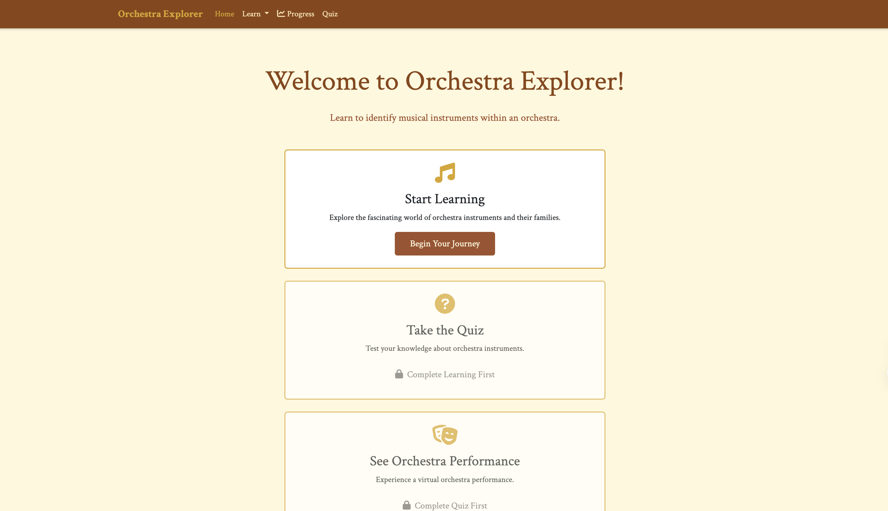
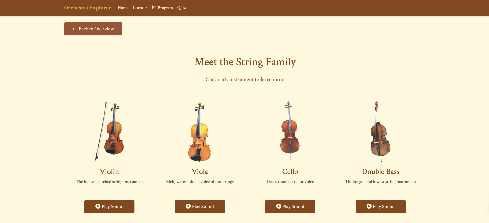
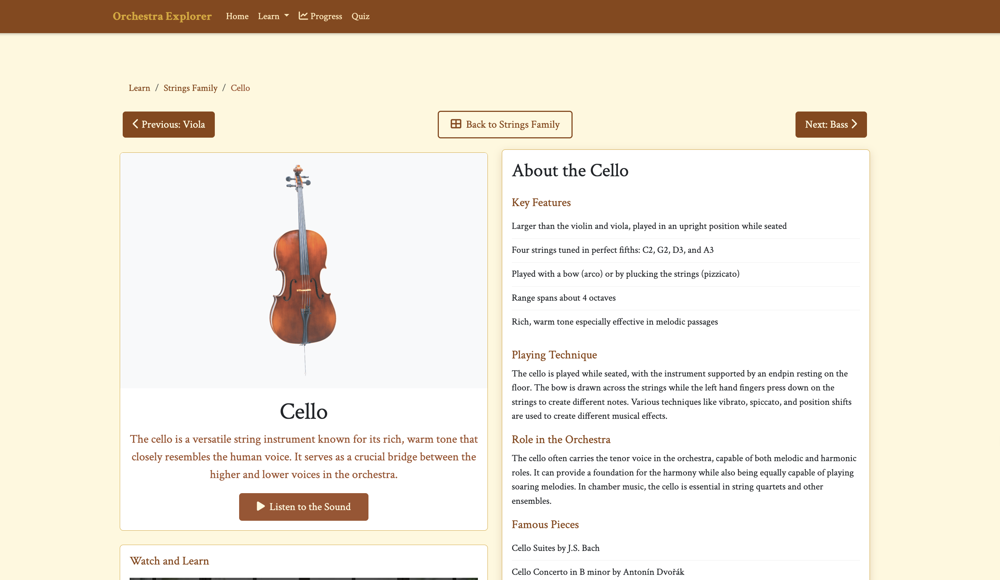

# Orchestra Explorer

Welcome to Orchestra Explorer, an interactive web application that helps users explore and learn about different sections and instruments in an orchestra. This educational tool provides detailed information about various orchestral instruments, their roles, and their unique characteristics, making it an excellent resource for music students and enthusiasts.



## Features
- Interactive orchestra layout visualization
- Detailed information about different instrument sections
- Individual instrument descriptions and characteristics
- Audio samples of instruments
- User-friendly navigation and intuitive interface




## Setup

1. Clone this repository

``` 
git clone https://github.com/Sallyliubj/Orchestra-Explorer.git
cd Orchestra-Explorer
```

2. Create a virtual environment:

```
python -m venv venv
source venv/bin/activate  # On Windows: venv\Scripts\activate
```

3. Install the dependencies

```
pip install -r requirements.txt
```

4. Run the app:

```
python app.py
```

The app will be running at http://127.0.0.1:5000


---
This project was developed as part of a collaborative effort for Columbia University's COMS 4170 UI Design course. 
